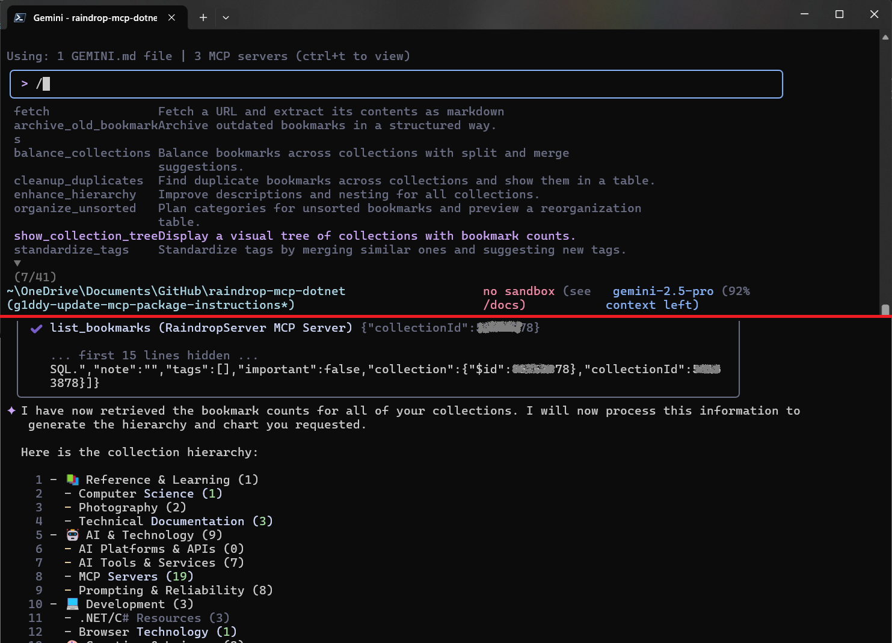

# Raindrop MCP .NET Integration

[](https://raindrop.io)

**A robust, high-quality Model Context Protocol (MCP) server for the Raindrop.io API, built with C# and .NET.**

This project provides a bridge, allowing AI models and development tools to securely and intelligently interact with your Raindrop.io bookmarks, collections, and highlights. It's designed for AI integrators, power users, and .NET developers looking to build powerful, context-aware applications.
Once connected, you can interact with the server using natural language. The server also includes pre-built sample prompts to help you discover its capabilities. In many clients, like the Gemini CLI tool, you can access these by typing `/` and selecting a command from the list that appears.



---

## 🚀 Key Features

- **AI-Ready:** Exposes Raindrop.io features as MCP tools, ready for consumption by agents like VS Code Copilot.
- **Secure:** Uses access tokens to securely connect to your Raindrop.io account.
- **Extensible:** Designed with dependency injection to be easily extended with new tools or data sources.
- **Developer-Friendly:** Strong-typed, well-documented, and easy to run and debug.

---

## 🗺️ Documentation Map

This project's documentation is structured using the [Diátaxis framework](https://diataxis.fr) to help you find what you need quickly.

| I want to...                              | Documentation                                    | Description                                                                     |
| :---------------------------------------- | :----------------------------------------------- | :------------------------------------------------------------------------------ |
| **...get started quickly.**               | 📖 **[Tutorial](./docs/TUTORIAL.md)**             | A hands-on guide to get the server running and make your first API call.        |
| **...add new functionality to the code.** | 🛠️ **[Developer How-To Guide](./docs/HOW_TO.md)** | Technical recipes for extending the server with new tools and features.         |
| **...understand the technical details.**  | 🔬 **[Technical Reference](./docs/REFERENCE.md)** | The encyclopedia of the project: API schemas, configuration, and class details. |
| **...understand the project's design.**   | 🧠 **[Explanation](./docs/EXPLANATION.md)**       | The "why" behind the project's architecture and design choices.                 |
| **...contribute to the project.**         | ❤️ **[Contributing Guide](./CONTRIBUTING.md)**    | Our guide for how to contribute code, documentation, or bug reports.            |
| **...release a new version.**             | 🚀 **[Releasing Guide](./docs/RELEASING.md)**     | How to publish new versions to NuGet and GitHub Packages.                       |

---

## 🚀 Getting Started

The best way to begin is by following our hands-on **[Tutorial](./docs/TUTORIAL.md)**.

It provides a complete walkthrough for configuring the server and connecting it to an AI client, allowing you to start managing your bookmarks right away.

### Configuration

To run the server locally, you will need to provide a Raindrop.io API token. This is done by setting the `Raindrop:ApiToken` environment variable. For example:

```bash
export Raindrop__ApiToken="YOUR_API_TOKEN"
```

The server uses a fail-fast mechanism and will not start if this environment variable is not set.

### Alternate Package Installation (GitHub Packages)

For users who prefer to use GitHub Packages, you can install the package by adding a `nuget.config` file to your project with the following content:

```xml
<?xml version="1.0" encoding="utf-8"?>
<configuration>
  <packageSources>
    <clear />
    <add key="github" value="https://nuget.pkg.github.com/g1ddy/index.json" />
    <add key="nuget.org" value="https://api.nuget.org/v3/index.json" />
  </packageSources>
  <packageSourceCredentials>
    <github>
      <add key="Username" value="YourGitHubUsername" />
      <add key="ClearTextPassword" value="YourGitHubPAT" />
    </github>
  </packageSourceCredentials>
</configuration>
```

Replace `YourGitHubUsername` with your GitHub username and `YourGitHubPAT` with a personal access token with the `read:packages` scope.

---

## 📝 License

This project is licensed under the MIT License. See the [LICENSE](./LICENSE) file for details.
